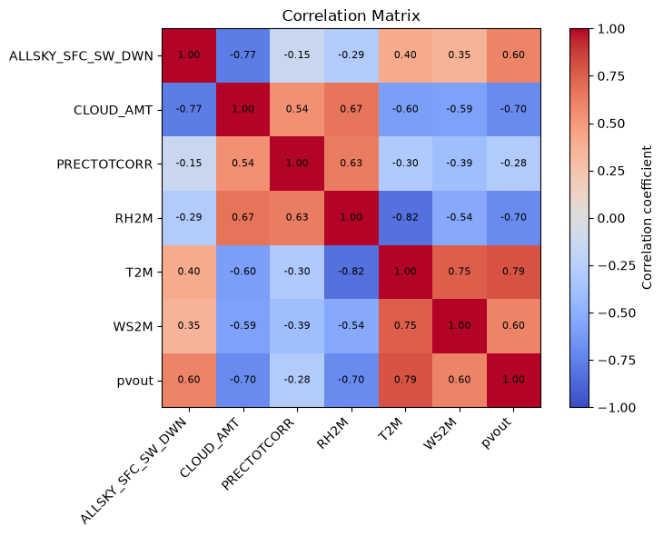

# **Background**

Multiple linear regression (MLR) model explaining photovoltaic power output potential (PVOUT) across Sri Lanka, using climatology data from the NASA POWER API and solar resource data from Global Solar Atlas.

This project began as part of my undergraduate research, where my focus was purely on the 'statistics'. So the code itself was a set of separate scripts split across Excel and Google Colab. Here I combined that complicated workflow into a single pipeline and turned academic/research code into something reusable and maintainable. I saw this as an opportunity to put the Python skills I've picked up since then to practice and I genuinely enjoy optimizing things as well.

___


### **1. Repository Structure**

```
.
├── setup.py               # Creates necessary folders and installs dependencies
├── data_collection.ipynb  # Fetches NASA POWER climatology data, extracts PVOUT from raster, merges, exports CSV
├── model_building.ipynb   # EDA, backward elimination MLR, residual diagnostics, model interpretation
├── data/                  # Created by setup.py - holds PVOUT.tif and generated CSV/JSON files
└── lib/                   # Created by setup.py - install location for project dependencies
```

___

### **2. Data Sources**

| Source | Data |
|---|---|
| [NASA POWER API](https://power.larc.nasa.gov/) | Monthly climatology (1999-2018): solar irradiance, cloud amount, rainfall, relative humidity, temperature, wind speed |
| [Global Solar Atlas](https://globalsolaratlas.info/download/sri-lanka) | PVOUT raster (`PVOUT.tif`) - photovoltaic power output potential |
 
- **NOTE**: This repository does not contain raw data from either NASA POWER or Global Solar Atlas.


- Click [here](https://power.larc.nasa.gov/docs/services/api/Public) for NASA POWER **API** documentation


- Click [here](https://power.larc.nasa.gov/parameters/) for NASA POWER **Parameter Dictionary** 

___

### **3. How to run the script locally:**

#### Viewing the notebooks only requires Jupyter Lab/Notebook installed in your computer. To run the code yourself, follow the instructions below.

#### **Prerequisites:**

1. Python and Jupyter Lab installed in local computer.

2. Internet connection (Fetch data from NASA POWER API and Download dependencies)


#### **Setup:**

1. Clone this repository to your local computer.

2. Download `Sri-Lanka_GISdata_LTAym_YearlyMonthlyTotals_GlobalSolarAtlas-v2_GEOTIFF.zip` file from the link above. (**Important** : Use the`PVOUT.tif` file in root folder in zip file.)

3. Place `PVOUT.tif` file in the repository root folder (same folder as `setup.py`).

4. Run `setup.py` and wait till Jupyter Lab lanches.

5. Run `data_collection.ipynb` first, then `model_building.ipynb` in Jupyter Lab.


___

### **4. Methodology**

1. **Data collection** - Query NASA POWER for 125 towns across all 25 districts of Sri Lanka (5 towns/district), extract PVOUT at each coordinate from the SolarGIS raster, merge into a single dataset.
2. **EDA** - Distribution, correlation, and scatter-plot review of 6 candidate predictors against PVOUT.
3. **Model selection** - Backward elimination from a full 6-predictor OLS model, dropping predictors for non-significance or high multicollinearity (VIF), evaluated at each step.
4. **Diagnostics** - Breusch-Pagan (homoscedasticity) and Jarque-Bera (residual normality) tests on the final model.

### **4.1.Variables Considered**

| Code | Variable | Source column |
|---|---|---|
| y | PVOUT (kWh/year) | `pvout` |
| x1 | Solar irradiance | `ALLSKY_SFC_SW_DWN` |
| x2 | Cloud amount | `CLOUD_AMT` |
| x3 | Rainfall | `PRECTOTCORR` |
| x4 | Relative humidity | `RH2M` |
| x5 | Ambient temperature | `T2M` |
| x6 | Wind speed | `WS2M` |

### **4.2. Correlation Matrix**



### **4.3. Model comparison**

| Metric | M0 (all 6) | M1 (dropped x2) | M2 (dropped x5) | M3 (dropped x2, x5) |
|:---:|:---:|:---:|:---:|:---:|
| R² | 0.740 | 0.740 | 0.731 | 0.731 |
| Adj. R² | 0.727 | 0.729 | 0.720 | 0.722 |
| All predictors significant | No (x2, x3, x5, x6 fail) | No (x3, x6 fail) | No (x2 fails) | **Yes** |
| Max VIF | 12.81 (x5) | 10.87 (x5) | 6.85 (x2) | **2.01** (x4) |
| Breusch-Pagan p-value | 0.0764 | 0.0658 | 0.1110 | 0.0857 |
| Jarque-Bera p-value | 0.1382 | 0.1229 | 0.0662 | 0.0798 |
| AIC | 1227 | 1226 | 1230 | 1228 |
| BIC | 1247 | 1243 | 1246 | **1242** |

### **4.4. Selected Model (M3)**

```
y = 1905.9273 + 107.7544·x1 + 20.5331·x3 − 13.5037·x4 + 16.4832·x6
```

All four predictors significant at p < 0.001, max VIF = 2.01 (no meaningful multicollinearity), passes both Breusch-Pagan and Jarque-Bera. Adjusted R² = 0.722.

**Interpretation:**
- **x1 (irradiance, Positive):** 
	- largest-magnitude coefficient; consistent with solar physics.

- **x4 (humidity, Negative):** 
	- higher humidity lowers PVOUT, consistent with atmospheric moisture/cloud cover reducing surface radiation.

- **x3 (rainfall, Positive):** 
	- positive sign runs counter to the naive physics expectation. 
	- Likely explained by 
		- (a) yearly-average data masking seasonal/monsoon and day-vs-night effects (Sri Lanka has two monsoon seasons with rainfall spread through the year.)
		- (b) rain washing dust/debris off panels, improving performance 
	- Can not conclude that "more rain improves output", without further investigation.

- **x6 (wind speed, Positive):** no direct physics link to modeled solar potential; plausibly explained by wind cooling panels (reducing efficiency loss from heat) and/or windier locations coinciding geographically with higher-irradiance, open/coastal sites.

### **4.5. Limitations**

- Cross-sectional analysis on yearly-average data - no seasonality captured (e.g., monsoon timing, day/night effects folded into daily/monthly averages).
- n = 125 locations, 5 per district, results may not generalize below the district level.
- Rainfall and wind speed coefficients are statistically significant but not fully explained by direct physical mechanisms (see interpretation above).
___
### **5. License**

Code in this repository is licensed under the MIT License. Data is subject to the licenses of its original providers.
___
